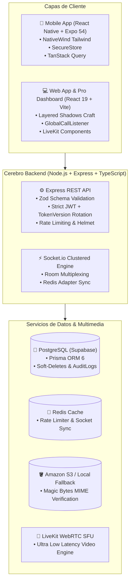

<div align="center">

# 🐾 ConectaVet (VetConnect) v2.0
### *Plataforma Integral de Telemedicina Veterinaria & Gestión Clínica de Alta Disponibilidad*
**Construida bajo Estándares de Ingeniería de Software FAANG (Google / Meta / Stripe / Vercel level)**

[](https://nodejs.org)
[](https://www.typescriptlang.org/)
[](https://react.dev)
[](https://expo.dev)
[](https://supabase.com)
[](https://www.prisma.io)
[](https://redis.io)
[](https://livekit.io)
[](https://jestjs.io)

</div>

---

## 📖 Índice General de Documentación

Toda la documentación técnica, legal y operativa del ecosistema ConectaVet se encuentra organizada en los siguientes documentos maestros:

| Documento | Descripción y Contenido | Enlace |
|---|---|---|
| 📜 **Project Charter** | Carta fundamental del proyecto: visión, misión, justificación, OKRs, matriz funcional y roadmap FAANG. | [Ver Project Charter](docs/PROJECT_CHARTER.md) |
| 🏛️ **Arquitectura del Sistema** | Topología distribuida, Domain-Driven Design, Sockets en clúster y marco legal (SENASA / Ley 25.326). | [Ver Arquitectura](docs/ARCHITECTURE.md) |
| ⚖️ **Registro de Decisiones (ADRs)** | 16 Architecture Decision Records detallando el porqué técnico de cada tecnología adoptada. | [Ver Decisiones](docs/DECISIONS.md) |
| 📚 **Referencia Técnica & APIs** | Mapa completo de endpoints REST, matriz de eventos Socket.io y modelos de datos. | [Ver Referencia Técnica](docs/TECH_REFERENCE.md) |
| 🚀 **Guía de Despliegue (Deploy)** | Configuración de Railway, Koyeb, Vercel, Supabase, Redis y compilación EAS para Android/iOS. | [Ver Guía de Deploy](docs/DEPLOY.md) |
| 📱 **Guía de Ejecución Local** | Tutorial paso a paso para encender todo el sistema y conectar un celular por cable USB con ADB. | [Ver Guía de Ejecución](GUIA_EJECUCION_CONECTAVET.md) |
| 📋 **Runbooks Operativos** | Procedimientos de recuperación ante desastres, rotación de secretos y mantenimiento de BD. | [Ver Runbooks](RUNBOOKS.md) |

---

## 🌟 Propuesta de Valor & Características Principales

**ConectaVet** es una solución telemédica integral que digitaliza la interacción clínica entre tutores de mascotas y médicos veterinarios:

- **🚨 Triage Inteligente & Cola de Atención:** Solicitud de atención inmediata o programada con balanceo automático hacia veterinarios disponibles.
- **💬 Chat en Vivo con Optimistic Updates:** Mensajería en tiempo real (<100ms) vía WebSockets, envío de imágenes clínicas en alta resolución con zoom y confirmación de lectura.
- **📹 Teleconsulta por Videollamada (WebRTC / LiveKit):** Transmisión de audio y video de baja latencia con timbrado bidireccional global en Web y Mobile.
- **💊 Recetas Digitales Estructuradas:** Generador de prescripciones con dosificación, frecuencia y duración, persistidas en la historia clínica del paciente.
- **🛡️ Blindaje Legal & Sala de Espera (SENASA):** Verificación manual de matrículas profesionales antes de habilitar la atención; cumplimiento estricto de la **Ley de Protección de Datos Personales N° 25.326** con *Soft-Deletes* y anonimización de PII.
- **📊 Registro Inmutable de Auditoría:** Registro de todas las operaciones administrativas críticas (`AuditLog`) para trazabilidad total.

---

## 🏗️ Topología del Sistema (FAANG Architecture)



---

## 💻 Requisitos Previos

| Requisito | Versión Mínima | Instalación |
|---|---|---|
| **Node.js** | `>= 20.x LTS` | [nodejs.org](https://nodejs.org) |
| **Git** | `>= 2.30` | [git-scm.com](https://git-scm.com) |
| **Expo Go** (para Mobile) | SDK 54 | [Google Play Store](https://play.google.com/store/apps/details?id=host.exp.exponent) |
| **ADB (Android Platform Tools)** | Opcional (incluido en scripts) | [developer.android.com](https://developer.android.com/tools/releases/platform-tools) |

> **Nota de Base de Datos:** No requiere instalar PostgreSQL local — el proyecto está preconfigurado con **Supabase** en la nube.

---

## ⚡ Guía de Inicio Rápido (Local Setup)

### Opción A: Inicio Automatizado (Recomendado)

1. **Backend y Web (Terminal 1):**
   ```powershell
   .\run.bat
   ```
   *Inicia el backend en el puerto 3001 y la Web en el puerto 5173 simultáneamente.*

2. **Mobile App (Terminal 2):**
   ```powershell
   .\start.ps1
   ```
   *Detecta automáticamente tu celular conectado por USB, configura los puertos de red con ADB Reverse e inicia Expo Go sin depender de Wi-Fi corporativo.*

---

### Opción B: Inicio Manual (3 Terminales)

#### Terminal 1: Backend
```bash
cd backend
npm install
npm run dev
```

#### Terminal 2: Frontend Web
```bash
cd web
npm install
npm run dev
```

#### Terminal 3: Mobile App
```bash
cd mobile
npm install
npm start
```

---

## 🧪 Pruebas Automatizadas & Calidad de Código

El backend cuenta con una suite de más de **119 pruebas unitarias y de integración** cubriendo autenticación, consultas, mascotas, autorización y manejo de errores:

```bash
# Ejecutar todas las pruebas con Jest
cd backend
npm test

# Ejecutar typecheck estricto de TypeScript en todo el monorepo
cd backend && npx tsc --noEmit
cd ../web && npx tsc -b
cd ../mobile && npx tsc --noEmit
```

---

## 👥 Equipo de Desarrollo & Créditos

- **Tobias Vera** — *Tech Lead & Backend Developer*
- **Juan Mendoza** — *Mobile Lead Developer*
- **Damian Orellana** — *Web Frontend Developer*
- **Ezequiel Charca** — *QA Automation Engineer & Product Designer*
- **Lara Bouso** — *Project Manager & Compliance Specialist*

*ConectaVet — Grupo Pinnacle 2026. Todos los derechos reservados.*
