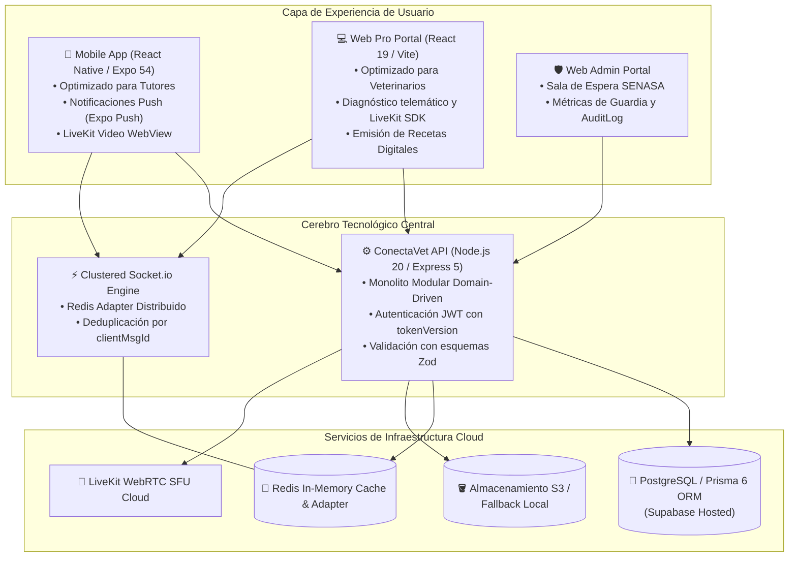

# 📄 PRODUCT & PROJECT BRIEF
## Proyecto: ConectaVet (VetConnect) — Ecosistema Digital de Telemedicina Veterinaria
**Document ID:** `BRIEF-CONECTAVET-2026-V2`  
**Autor:** Senior / Staff Systems Architect (FAANG Tier Standards)  
**Organización:** Grupo Pinnacle / ConectaVet Team  
**Fecha de Emisión:** Septiembre 2026  
**Audiencia:** Comité Ejecutivo, Stakeholders, Engineering Leads & Product Directorate  
**Estado:** `APPROVED (EXECUTIVE BASELINE)`  

---

## 1. Resumen Ejecutivo (Executive Summary)

**ConectaVet** es una plataforma tecnológica integral de telemedicina veterinaria de alta disponibilidad diseñada para conectar de forma instantánea, segura y auditable a tutores de mascotas con médicos veterinarios matriculados y certificados en América Latina.

La plataforma resuelve el vacío existente entre la consulta física programada y la emergencia veterinaria crítica, sustituyendo canales de comunicación informales y de alto riesgo (mensajería por WhatsApp, llamadas no reguladas) por un ecosistema digital clínico que combina:
1. **Atención Inmediata por Triaje:** Cola inteligente de espera con auto-asignación y balanceo en tiempo real.
2. **Consultas Multimedia de Alta Fidelidad:** Mensajería sincrónica (WebSockets) y videoconsultas en vivo de ultra baja latencia (WebRTC / LiveKit SFU).
3. **Historia Clínica Digital Centralizada:** Repositorio inmutable de pacientes con antecedentes, evolución y cumplimiento de normativas de privacidad.
4. **Receta Digital Oficial:** Prescripciones médicas estructuradas con validación por código QR y firma digital habilitada.

---

## 2. Declaración del Problema & Oportunidad de Mercado

### 2.1 El Problema Clínico y Operativo
- **Consultas Informales y Peligro de Automedicación:** Ante síntomas nocturnos o dudas repentinas, los dueños de mascotas recurren a consejos en internet o mensajes directos a profesionales, propiciando diagnósticos erróneos y administración de fármacos tóxicos para animales (ej. paracetamol o ibuprofeno).
- **Falta de Validación de Matrícula e Idoneidad:** Proliferación de personas no habilitadas ejerciendo la medicina veterinaria en canales digitales sin control de los Colegios Médicos Veterinarios ni organismos regulatorios sanitarios (**SENASA** en Argentina).
- **Fragmentación Histórica y Pérdida de Información:** Inexistencia de un registro interoperable; cuando una mascota requiere atención de guardia o derivación a especialista, el profesional carece de antecedentes terapéuticos, peso histórico y alergias previas.
- **Inseguridad Jurídica y Vulnerabilidad Legal:** El profesional atiende sin consentimiento informado firmado, sin registro auditable de la interacción y sin respaldo frente a reclamos por mala praxis telemática.

### 2.2 La Oportunidad
Capturar la demanda latente en una región donde **más del 70% de los hogares conviven con animales de compañía**, estableciendo la primera infraestructura de telemedicina veterinaria que cumpla estrictamente con la **Ley de Protección de Datos Personales N° 25.326**, ofreciendo una solución confiable para tutores y una herramienta de monetización ordenada para veterinarios.

---

## 3. Objetivos Estratégicos & OKRs (Objectives and Key Results)

```
+-----------------------------------------------------------------------------------------+
|                                    STRATEGIC OKRs                                       |
+---------------------------------------------------+-------------------------------------+
| Objetivo Estratégico                              | Key Result (Resultado Clave)        |
+---------------------------------------------------+-------------------------------------+
| 1. Eficiencia en el Acceso a la Salud Animal      | KR 1.1: Time to Care (TTC) < 3 min. |
|    (Reducir fricción y demoras críticas)          | KR 1.2: Tasa de asignación > 92%.   |
+---------------------------------------------------+-------------------------------------+
| 2. Excelencia y Cumplimiento Sanitario/Legal      | KR 2.1: 100% de veterinarios con    |
|    (Cero tolerancia a ejercicio ilegal)           | matrícula validada antes de operar. |
|                                                   | KR 2.2: Cero incidentes de fuga PII.|
+---------------------------------------------------+-------------------------------------+
| 3. Calidad de Software de Nivel FAANG             | KR 3.1: Cobertura de tests > 80%.   |
|    (Confiabilidad, escalabilidad y resiliencia)   | KR 3.2: Uptime del servicio >= 99.9%|
|                                                   | KR 3.3: 0 errores TypeScript en CI. |
+---------------------------------------------------+-------------------------------------+
```

---

## 4. Personas de Usuario & Propuesta de Valor

### 4.1 Tutor de Mascota (Pet Parent)
* **Perfil:** Dueño de una o más mascotas que busca respuestas rápidas y confiables ante síntomas repentinos o seguimiento clínico.
* **Propuesta de Valor:** Acceso en menos de 3 minutos a un médico veterinario habilitado desde su teléfono móvil (Android/iOS) o navegador web, videoconsulta de alta definición, historial unificado de sus mascotas y prescripción digital descargable.

### 4.2 Médico Veterinario Matriculado
* **Perfil:** Profesional veterinario que desea brindar atención telemática organizada, flexible y legalmente respaldada.
* **Propuesta de Valor:** Panel web ergonómico (`Web Pro Dashboard`) para gestionar consultas activas, acceder a la ficha del paciente antes de responder, emitir recetas formales con QR y recibir valoraciones de tutores.

### 4.3 Administrador & Auditor de Cumplimiento
* **Perfil:** Miembro del equipo de operaciones, auditoría médica o soporte regulatorio.
* **Propuesta de Valor:** Sala de espera administrativa para validar matrículas profesionales contra padrones públicos, métricas globales de utilización y un registro inmutable de auditoría (`AuditLog`) para responder a requerimientos judiciales o sanitarios.

---

## 5. Descripción del Ecosistema de la Solución

El producto opera como un **ecosistema tripartito** sincronizado:



---

## 6. Alcance del Proyecto: Límites & Non-Goals

### 6.1 En Alcance (In-Scope — Versión 2.0)
- Autenticación segura con cookies `HttpOnly`, JWT de corta duración y revocación atómica mediante `tokenVersion`.
- CRUD completo de mascotas con historial de consultas, alergias y condiciones crónicas.
- Cola de espera telemática inteligente con auto-asignación a veterinarios online habilitados.
- Chat médico en vivo con soporte de imágenes y deduplicación por clave de idempotencia (`clientMsgId`).
- Videoconsulta WebRTC de alta fidelidad respaldada por LiveKit SFU.
- Emisión de recetas médicas digitales descargables con firma y código QR.
- Sala de espera administrativa para verificación manual de matrículas veterinarias.
- Procedimiento de Soft-Delete y anonimización de PII cumpliendo la Ley 25.326.
- Registro inmutable de acciones administrativas (`AuditLog`).

### 6.2 Fuera de Alcance Explícito (Non-Goals)
- **Servicio de Ambulancias o Emergencias Quirúrgicas Físicas:** El sistema no despacha unidades móviles de rescate.
- **Marketplace E-commerce de Insumos o Alimentos:** No se comercializan productos físicos en la plataforma; las recetas son de libre dispensación en farmacias veterinarias externas.
- **Reemplazo del Plan de Vacunación Obligatoria Presencial:** Toda inmunización requiere acto físico in situ no sustituible por telemedicina.

---

## 7. Métricas de Éxito & North Star KPIs

| Métrica | Definición | Meta Trimestral (Q1 Post-Launch) |
|---|---|---|
| **North Star KPI** | Total de consultas finalizadas exitosamente con diagnóstico y/o receta emitida. | $> 2,500$ consultas/mes |
| **Time to Care (TTC)** | Tiempo desde la solicitud de consulta hasta el contacto con el profesional. | Mediana $< 180$ segundos |
| **First Contact Resolution (FCR)** | Consultas resueltas sin derivación urgente por el mismo síntoma en 48 hs. | $> 70\%$ |
| **Net Promoter Score (NPS)** | Grado de recomendación de tutores tras la consulta. | $> 75$ puntos |
| **Professional Compliance Rate** | Porcentaje de veterinarios en atención con matrícula debidamente aprobada. | **$100\%$ (Cero desvíos)** |

---

## 8. Gobernanza, Cronograma de Hitos & Recursos

### 8.1 Cronograma Resumido de Hitos
- **Hito 0 (M0):** Cimientos de Seguridad, Sanitización de Git & Zero-Drift de Base de Datos.
- **Hito 1 (M1):** Core Telemédico, Clustered WebSockets & Teleconsulta LiveKit.
- **Hito 2 (M2):** Cumplimiento Normativo SENASA, Soft-Deletes & Recetas con QR.
- **Hito 3 (M3):** Quality Engineering, Tests de Concurrencia y E2E Crítico.
- **Hito 4 (M4):** Despliegue en VPS (Coolify + Traefik), Vercel CDN y Release Mobile EAS.

### 8.2 Matriz de Liderazgo del Equipo
- **Tech Lead & Backend Systems:** Tobias Vera
- **Mobile Engineering Lead:** Juan Mendoza
- **Web Frontend Engineering Lead:** Damian Orellana
- **QA Automation & Product Design:** Ezequiel Charca
- **Program Management & Regulatory Ops:** Lara Bouso

---

## 9. Aprobación y Formalización

| Rol | Nombre | Decisión | Fecha |
|---|---|---|---|
| **Staff Solutions Architect** | Antigravity AI (FAANG Engineering) | `APPROVED` | 2026-09-12 |
| **Tech Lead** | Tobias Vera | `APPROVED` | 2026-09-12 |
| **Project Manager** | Lara Bouso | `APPROVED` | 2026-09-12 |
