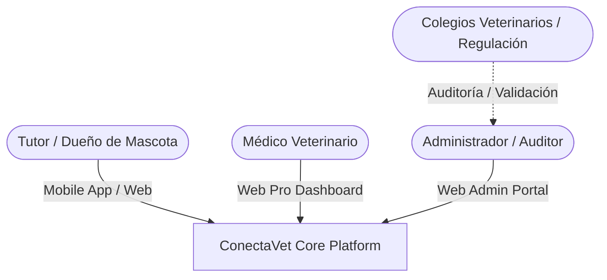
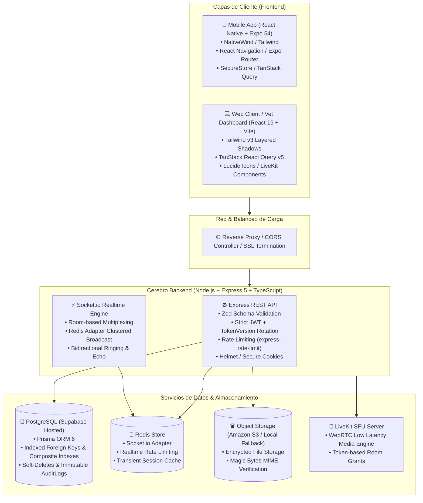
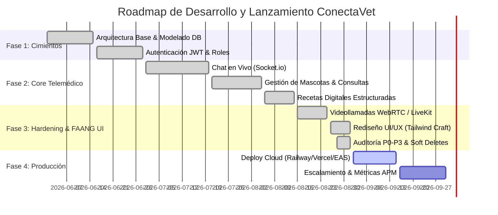

# 📜 PROJECT CHARTER: CONECTAVET (VetConnect)
## Plataforma Integral de Telemedicina Veterinaria & Gestión Clínica de Alta Disponibilidad

---

### Metadatos del Documento
- **Proyecto:** ConectaVet (VetConnect)
- **Versión:** 2.0 (FAANG-Ready Enterprise Edition)
- **Fecha de Emisión:** Septiembre 2026
- **Organización:** Grupo Pinnacle / ConectaVet Team
- **Estado:** Aprobado / En Producción & Escalamiento
- **Nivel de Estándar:** FAANG Engineering Standards (Google / Meta / Stripe / Vercel level)

---

## 1. Resumen Ejecutivo (Executive Summary)

**ConectaVet** es un ecosistema digital integral de telemedicina veterinaria de grado médico diseñado para transformar la atención sanitaria de animales de compañía en América Latina. La plataforma conecta de manera segura, auditable y en tiempo real a dueños de mascotas (tutores) con profesionales veterinarios matriculados y certificados.

El sistema combina:
1. **Aplicación Móvil Nativa (React Native / Expo):** Diseñada para tutores, optimizada para baja latencia, acceso rápido a emergencias, historial clínico y gestión de consultas.
2. **Panel Web de Alto Rendimiento (React 18 / Vite / TailwindCSS):** Diseñado para veterinarios y administradores, con herramientas de diagnóstico telemático, emisión de recetas estructuradas y panel de control con auditoría legal.
3. **Backend Monolítico Modular Distribuido (Node.js / Express / TypeScript / Redis / PostgreSQL / LiveKit):** Arquitectura resiliente con sincronización de sockets en clúster, almacenamiento desacoplado (S3 con fallback local) y persistencia bajo normativas legales estrictas.

---

## 2. Justificación del Negocio y Declaración del Problema

### 2.1 El Problema
- **Barreras geográficas y temporales:** Urgencias y dudas veterinarias en horarios no comerciales que colapsan guardias físicas o terminan en automedicación riesgosa.
- **Falta de trazabilidad y validación profesional:** Proliferación de consultas informales por mensajería instantánea no profesional (WhatsApp), sin consentimiento informado, sin registro histórico legal y sin validación de matrícula del profesional ante colegios veterinarios y organismos reguladores (SENASA).
- **Pérdida de historias clínicas:** Registros fragmentados en papel o sistemas locales incompatibles, lo que compromete la continuidad de tratamientos crónicos.

### 2.2 La Oportunidad
Crear la primera plataforma interoperable de telemedicina veterinaria en la región que cumpla con el 100% de la **Ley de Protección de Datos Personales (Ley 25.326)**, normativas de los Colegios de Veterinarios, validación de identidad profesional y emisión de recetas digitales válidas.

---

## 3. Visión, Misión y Objetivos Estratégicos

### 3.1 Visión
Convertirse en la infraestructura digital de referencia para la salud animal en el mercado hispanohablante, estableciendo el estándar de oro en telemedicina, recetas digitales e historias clínicas interoperables.

### 3.2 Misión
Proveer a dueños de mascotas y veterinarios de una plataforma tecnológica de vanguardia, ultrarrápida, accesible y legalmente blindada, que garantice una atención humanizada y oportuna a las mascotas en cualquier momento y lugar.

### 3.3 Objetivos OKR (Objectives and Key Results)
- **OKR 1 (Calidad de Software):** Mantener cero errores de tipado TypeScript (`tsc --noEmit`), suite de más de 120 tests automatizados con cobertura > 80% y cumplimiento de accesibilidad WCAG 2.1 AA.
- **OKR 2 (Rendimiento & Conectividad):** Tiempo de entrega de mensajes en tiempo real < 100ms vía WebSockets distribuidos; inicio de videollamadas peer/sfu < 1.5s; tiempo de carga inicial de pantallas < 800ms.
- **OKR 3 (Seguridad & Cumplimiento Legal):** 100% de veterinarios verificados manualmente en Sala de Espera (Pending Approval); auditoría inmutable de acciones administrativas (`AuditLog`); soporte integral de Soft-Deletes con anonimización de datos sensibles.

---

## 4. Alcance del Proyecto (Scope & Feature Matrix)

### 4.1 Actores del Ecosistema

### 4.2 Matriz Funcional por Rol

| Módulo | Tutor / Cliente (Mobile & Web) | Médico Veterinario (Web Pro) | Administrador (Admin Portal) |
|---|---|---|---|
| **Autenticación & Cuentas** | Registro, Login con JWT rotativo, perfil de tutor, recuperación de clave. | Registro con carga de matrícula y especialidad; estado PENDING hasta aprobación. | Gestión de usuarios, baneo, aprobación/rechazo de veterinarios, auditoría. |
| **Gestión de Mascotas** | CRUD completo de mascotas (especie, raza, edad/fecha nacimiento, sexo, peso, fotos). | Visualización de ficha clínica del paciente y antecedentes antes de aceptar la consulta. | Supervisión global y métricas de pacientes registrados. |
| **Cola & Asignación** | Solicitud de consulta (inmediata o programada), cola inteligente con auto-asignación. | Selector de consultas activas/pendientes, aceptación/rechazo en un clic. | Balanceo de carga y reasignación de consultas estancadas. |
| **Chat en Tiempo Real** | Mensajería instantánea bidireccional (Socket.io), envío de imágenes, confirmaciones de entrega y echo optimista. | Chat en vivo, visualizador de imágenes clínicas en alta resolución, zoom y diagnóstico. | Auditoría de sesiones ante reclamos legales (anonimizada). |
| **Videollamadas** | Conexión WebRTC/LiveKit integrada en Web y encapsulada en WebView móvil con permisos automáticos. | Sala de teleconsulta con controles de cámara, micrófono, cambio de dispositivo y diagnóstico. | Registro de duración, métricas de calidad de llamada (QoS) y timestamp de inicio/cierre. |
| **Recetas Digitales** | Recepción de receta digital en tiempo real con descarga y persistencia en historial. | Generador de recetas estructuradas (medicación, dosis, frecuencia, duración, indicaciones). | Registro auditable inmutable de prescripciones emitidas. |
| **Historial & Calificación** | Historial clínico completo, valoraciones con estrellas (1-5) y comentarios. | Historial de consultas atendidas, registro de notas clínicas de evolución. | Métricas de satisfacción, NPS y ranking de atención profesional. |

---

## 5. Arquitectura Técnica de Nivel FAANG

### 5.1 Diagrama de Topología del Sistema

### 5.2 Decisiones Arquitectónicas Clave (Architecture Decision Records)
- **ADR-001 (Monolito Modular):** Domain-Driven Design estructurado en módulos (`auth`, `users`, `pets`, `consultations`, `calls`, `media`, `notifications`) para máxima cohesión y mínimo acoplamiento sin la sobrecarga operativa de microservicios prematuros.
- **ADR-004 (Seguridad JWT & Token Versioning):** Tokens JWT de corta duración combinados con un mecanismo de `tokenVersion` en base de datos. Si un usuario cambia su contraseña, se cierra su sesión o es revocado por un admin, el `tokenVersion` se incrementa e invalida inmediatamente todos los tokens emitidos.
- **ADR-005 (Soft-Deletes & Anonimización Legal):** Las historias clínicas y consultas veterinarias nunca se eliminan físicamente (requerimiento legal). La eliminación de usuarios ejecuta una anonimización de PII (Personally Identifiable Information) preservando el historial para fines periciales.
- **ADR-009 (Tiempo Real Dual Socket + Redis Adapter):** Comunicación bidireccional mediante WebSockets optimizados con `@socket.io/redis-adapter` que permite balanceo horizontal entre múltiples contenedores sin pérdida de estado.
- **ADR-010 (Almacenamiento Resiliente de Adjuntos):** Soporte multi-proveedor con subida a Amazon S3 y fallback inteligente a almacenamiento local verificado por firma de bytes reales (evitando spoofing de extensiones).

---

## 6. Cumplimiento Normativo & Seguridad Jurídica (Argentina / LatAm)

### 6.1 Validación Profesional (SENASA & Colegios Veterinarios)
El sistema implementa un estado `vetStatus: PENDING` al momento del registro de cualquier médico veterinario. La plataforma **bloquea el acceso a atención telemática** hasta que el equipo de auditoría administrativa corrobora el número de matrícula y vigencia profesional contra los padrones oficiales correspondientes.

### 6.2 Ley de Protección de Datos Personales N° 25.326
- Encriptación de contraseñas mediante **BCrypt con factor de costo 12**.
- Sanitización de respuestas HTTP para garantizar que hashes de contraseñas, tokens internos o información confidencial nunca viajen al cliente.
- `AuditLog` inmutable que registra: `adminId`, `action`, `targetType`, `targetId`, `metadata`, `ipAddress` y `userAgent`.

---

## 7. Plan de Ejecución, Roadmap & Sprints

---

## 8. Gobernanza del Equipo & Matriz RACI

| Rol | Integrante | Responsabilidades Principales |
|---|---|---|
| **Tech Lead / Backend Lead** | Tobias Vera | Arquitectura de API, base de datos Prisma/PostgreSQL, seguridad JWT, sockets en tiempo real y tests unitarios/integración. |
| **Mobile Lead Developer** | Juan Mendoza | Aplicación React Native (Expo), integración de navegación, cámara, push notifications y compatibilidad Android/iOS. |
| **Web Frontend Lead** | Damian Orellana | Paneles Web (Tutor, Veterinario, Admin) en React 19, componentes UI, estados con TanStack Query y videollamadas WebRTC. |
| **QA Engineer & Product Designer** | Ezequiel Charca | Diseño de interfaces en Figma, diseño de design system, auditorías de usabilidad (UX/UI), pruebas E2E y matriz de accesibilidad. |
| **Project Manager & Legal Ops** | Lara Bouso | Coordinación de sprints, cumplimiento normativo SENASA, documentación funcional y seguimiento de entregables. |

---

## 9. Criterio de "Listo para Producción" (Definition of Done)

Para considerar cualquier entrega como completada bajo estándar FAANG:
1. **Compilación Limpia:** `npx tsc --noEmit` debe ejecutarse con 0 errores en backend, web y mobile.
2. **Linting Estricto:** `npm run lint` sin warnings ni deshabilitaciones de reglas no justificadas.
3. **Tests Automatizados:** Toda la suite de Jest (`npm test`) debe pasar al 100% de éxito.
4. **Resiliencia de Red:** Comprobación de reconexión automática en WebSockets ante cortes intermitentes de red.
5. **No Secrets in Repo:** Ningún archivo `.env` o credencial sensible debe ser trackeado por Git.
6. **Auditoría Documentada:** Todo cambio arquitectónico debe acompañarse de su respectiva actualización en `README.md` y `docs/`.

---

*Documento aprobado por el equipo de ingeniería de ConectaVet. Prohibida su reproducción no autorizada.*
